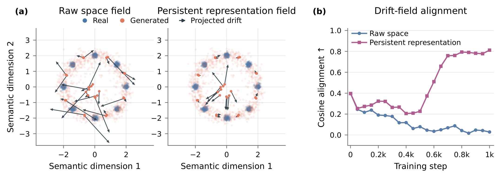

# Learning Discriminative Geometry for Drifting Models

<p align="center">
  
</p>

## News

- **[2026-10]** Code released.

## Files

| File | Content |
|---|---|
| `unet.py` | U-Net generator mapping Gaussian noise to images in a single forward pass |
| `encoder.py` | Residual encoder $E_\varphi(x)=x+R_\varphi(x)$ with zero-initialized output projection, and the feature groups extracted from its intermediate maps |
| `kde_loss.py` | KDE classification objective used to update the encoder |
| `drift.py` | Drifting field in the learned representation, velocity clipping, and drift regression loss |
| `distributed.py` | Collective operations for gathering KDE anchors across GPUs |
| `train.py` | Alternating encoder and generator updates |
| `sample.py` | Sample generation from a checkpoint |

## Environment Setup

```bash
conda create -n pdrift python=3.11 -y
conda activate pdrift
pip install torch==2.7.1+cu128 torchvision==0.22.1+cu128 --extra-index-url https://download.pytorch.org/whl/cu128
pip install -r requirements.txt
```

## Training

Each training step performs one encoder update on a fresh real and generated batch, followed by one generator update on another fresh batch. The KDE anchors are gathered across all GPUs.

All reported experiments use 4 NVIDIA GH200 GPUs with 96 GB of GPU memory each. The training set is downloaded automatically by torchvision to `--data-root`.

```bash
torchrun --nproc_per_node 4 train.py --dataset cifar10 --data-root ./data --output-dir ./runs/cifar10
torchrun --nproc_per_node 4 train.py --dataset cifar100 --data-root ./data --output-dir ./runs/cifar100
torchrun --nproc_per_node 4 train.py --dataset svhn --data-root ./data --output-dir ./runs/svhn
```

## Sampling

```bash
python sample.py --checkpoint ./runs/cifar10/checkpoints/step0050000.pt --output-dir ./samples/cifar10 --num-samples 50000
```

FID can be computed between the generated samples and the training set with a standard implementation such as `pytorch-fid`.

## Citation

BibTeX coming soon.

## Acknowledgements

This codebase builds on [DriftXpress](https://github.com/Mortrest/DriftXpress). We thank the authors for releasing their code.

## License

This project is released under the [MIT License](LICENSE).
